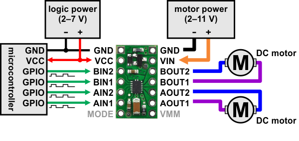
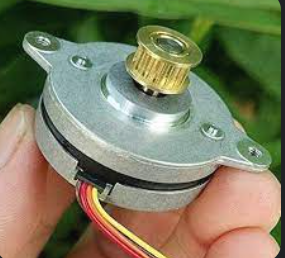
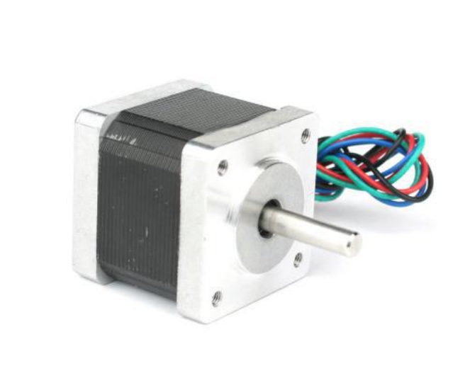
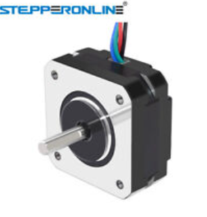
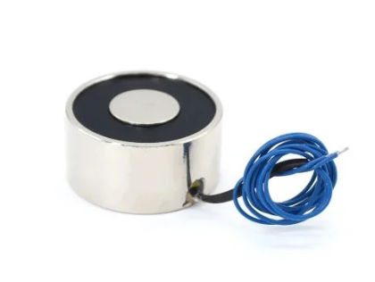
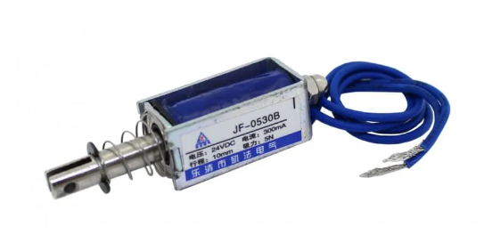
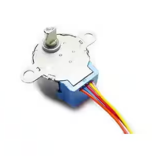

Quad Motor Shield
-----------------

DRV8835 Motor Shield
---------------------
    firmware: https://github.com/pololu/drv8835-motor-shield
    hardware: https://www.pololu.com/product/2135

STH-36C0062
------------

    4 lines A+Brown A-Orange B+Red B-Yellow
    AOUT1 -> Brown
    AOUT2 -> Orange
    BOUT1 -> Red
    BOUT2 -> Yellow

JK35HS28-0504 (Nema 14) 10V
-------

https://ecksteinimg.de/Datasheet/Schrittmotor/JK35HS28-0504/JK35HS28-0504-01F.pdf

    Spule 1
    Black & Green

    Spule 2
    Red & Blue

    Speed max: 500

    stepper.setAcceleration(200);
    stepper.setMaxSpeed(-500);
    stepper.setSpeed(-500);	

17HS08-1004S (Nema 17) (3.5V)
------------

https://www.omc-stepperonline.com/download/17HS08-1004S.pdf

    Spule 1
    Black & Green

    Spule 2
    Red & Blue

KK-P40/20 (Electromagnet) 24V
-------------------------

https://robu.in/product/dc-24v-p40-20-30kg-lifting-solenoid-electromagnet/

    void loop() {
    bool toggle1 = digitalRead(0);
    int value = 255;
    if (toggle1) {
        value = 255;
    } else {
        value = 0;
    }
    analogWrite(2, value);
    analogWrite(3, value);
    delay(20);
    }

JF-0530B (Mini Solenoide) 12V
--------

    analogWrite(2, 255);
    analogWrite(3, 255);
    delay(50);
    analogWrite(2, 0);
    analogWrite(3, 0);
    delay(500);

28BYJ-48 (stepper motor) 5V
--------

https://www.digikey.de/htmldatasheets/production/1839399/0/0/1/28byj-48.pdf
